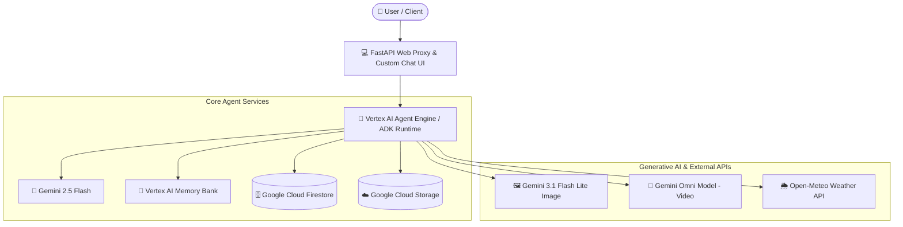

# ✈️ GlobeTrotter AI — Travel & Experience Concierge

[](https://cloud.google.com/)
[](https://deepmind.google/technologies/gemini/)
[](https://github.com/google/adk)
[](https://www.python.org/)

**GlobeTrotter AI** is an intelligent, conversational travel agent built on Google Cloud Platform using Google's **Agent Development Kit (ADK)**, **Gemini 2.5 Flash**, **Vertex AI Agent Engine**, and Google's **Omni model**. 

It empowers travelers to explore global destinations, fetch real-time weather forecasts, generate custom AI scenic postcard images and preview videos, calculate detailed trip budget breakdowns, and remember personal dietary restrictions and travel preferences across sessions.

---

## 🏗️ System Architecture



---

## 🌟 Implemented Features & Google Cloud Services

The following tools and GCP integrations are fully implemented in code (`app/`):

### 🧠 Long-Term Memory (Vertex AI Memory Bank)
* **Persistent User Memory**: Integrated with `VertexAiMemoryBankService` to store and recall user allergies, dietary restrictions (e.g., peanut allergy, lactose intolerance), and travel preferences persistently across conversation sessions (`save_user_allergy`, `get_user_allergies`).

### 🗄️ Destination Catalog (Google Cloud Firestore)
* **Destination Records**: Stores, queries, and adds travel destinations and points of interest (`search_destinations`, `get_destination_details`, `add_destination`) in Google Cloud Firestore.

### 🖼️ Scenic AI Image Generation (Gemini 3.1 Flash Lite Image)
* **Custom Postcards & Destination Previews**: Generates scenic travel images using `gemini-3.1-flash-lite-image` in the `global` region. Images are saved as Playground artifacts via `tool_context.save_artifact` and uploaded to Google Cloud Storage.

### 🎥 AI Video Generation (Gemini Omni Model)
* **Destination Preview Clips**: Generates short travel preview videos using Google's Omni model (`gemini-omni-flash-preview`) in the `global` region via the Vertex AI Interactions API. Videos are saved as MP4 artifacts and uploaded directly to Cloud Storage.

### ☁️ Media Storage (Google Cloud Storage)
* **Public Cloud Storage Bucket**: Uploads generated destination images and MP4 videos directly from memory to Google Cloud Storage (`globetrotter-ai-media-96832b3e79d0`) and returns public HTTPS URLs.

### 🌦️ Real-Time Weather & Location Services
* **Live Weather Forecasting**: Fetches current weather, temperature (°C/°F), and wind speed using Open-Meteo API (`fetch_live_weather`).
* **Geocoding & Nearby Attractions**: Geocodes address coordinates (`geocode_address`) and lists top points of interest (`find_nearby_places`) with automatic fallbacks.

### 💰 Trip Budget Calculator
* **Multi-Tier Expense Breakdowns**: Calculates detailed trip expense breakdowns (lodging, dining, activities, local transport, and optional flights) across budget, mid-range, and luxury tiers (`calculate_trip_budget`).

### 🎨 A2UI Schema-Driven UI Cards (Agent-to-User Interface v0.8)
* **Structured UI Output**: Uses `A2uiSchemaManager` (v0.8) and `BasicCatalog` with an `after_model_callback` (`a2ui_callback`) to return interactive structured UI cards for budgets, weather, and destination details.

### 💻 Web Frontend & FastAPI Proxy (`frontend/`)
* **Custom Chat Interface**: Modern web interface themed in Ocean Teal (`#0284c7`) with Google `Outfit` typography, interactive prompt chips, dialogue layout, and native base64 / A2UI card rendering powered by a lightweight FastAPI proxy.

---

## 📌 Planned / Future Features

The following features were outlined in initial design notes but are **not yet implemented**:
* ⏳ **Currency Conversion**: Automatic real-time foreign exchange currency conversion for trip expenses.
* ⏳ **Group Expense Splitting**: Multi-person bill and group travel expense split calculations.

---

## 📁 Repository Structure

```
globetrotterai/
├── app/                        # Core agent implementation
│   ├── agent.py                # Main agent definition, tools, & system prompts
│   ├── a2ui_utils.py           # A2UI callback and schema parsing utilities
│   └── seed_db.py              # Firestore database seeder script
├── frontend/                   # Web frontend and FastAPI proxy
│   ├── main.py                 # FastAPI backend proxy communicating with Agent Engine
│   └── static/
│       └── index.html          # Ocean Teal web chat interface with A2UI card renderer
├── deployment_metadata.json    # Agent Platform deployment metadata
├── agents-cli-manifest.yaml    # Agents CLI project configuration
├── pyproject.toml              # Python project dependencies (uv)
└── README.md                   # Project documentation
```

---

## 🛠️ Local Setup & Execution Instructions

### Prerequisites
* Python 3.10+
* [`uv`](https://docs.astral.sh/uv/) package manager
* Google Cloud SDK (`gcloud`) with active authentication

### 1. Install Dependencies
```bash
uv sync
```

### 2. Configure Environment Variables
Create a `.env` file in the project root:
```env
FIRESTORE_PROJECT=qwiklabs-gcp-02-96832b3e79d0
GOOGLE_GENAI_USE_VERTEXAI=true
GOOGLE_CLOUD_LOCATION=us-east1
```

### 3. Run Agent via ADK Web Server
Launch the local ADK development server and Playground:
```bash
uv run adk web . --port 8080 --reload_agents
```

### 4. Run Custom Web Frontend (FastAPI Proxy)
In a separate terminal, launch the custom web chat frontend:
```bash
uv run python frontend/main.py
```

---

## 🚀 Deployment to Vertex AI Agent Runtime

To deploy or update the agent on Vertex AI Agent Runtime:
```bash
uv run agents-cli deploy --no-confirm-project --update-env-vars GOOGLE_GENAI_USE_VERTEXAI=true
```

---

## 🧪 Testing

Run unit and integration test suites:
```bash
uv run pytest tests/unit tests/integration
```